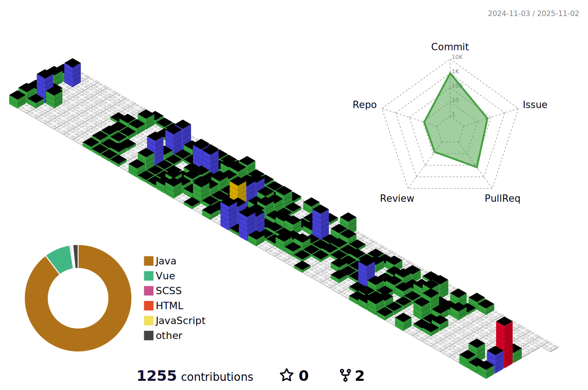

  Studying of backend 💻

 
<h3 align="center"><b>🔎 Hits</b></h3>

 

<h3 align="center"><b>📚 Tech Stack</b></h3>

  
  
  
  
  

 

<h3 align="center"><b>💌 Contact </b></h3>

 
 

 

  


 

 
   

